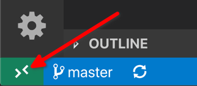

# Documentation — Pain'Gouin

## Résumé rapide du projet

Pain'Gouin est une application web développée avec le framework Django pour gérer la vente et la livraison des produits de boulangerie sur la résidence étudiante Léonard de Vinci de Centrale Lille :
- la gestion des utilisateurs et de leurs soldes,
- la création et la gestion des livraisons et commandes,
- l'intégration de moyens de paiement (transactions manuelles, et HelloAsso Checkout pour des paiements par carte bancaire),
- un backoffice pour administrer produits, livraisons et transactions.

Le site a été initialement développé en 2024 par [Mathis Rimbert](https://github.com/mrimbert), puis réusiné et amélioré par [Valentin Grégoire](https://github.com/vale075) en 2025-2026.

Ce site a été réalisé (et est géré) par des autodidactes et non par des professionnels, il s'agit donc d'une usine à gaz, il faut faire attention à ce qu'on fait et ne pas hésiter à poser des questions en cas de doute.

## Généralités sur le site

Ce site a été développé à l'aide du framework Django. C'est un framework Python conçu pour faciliter le développement de site web sécurisé. Ce framework a été choisi pour faciliter les modifications du site web par les futurs responsables web, Python étant un langage bien mieux connu (notamment par la classe préparatoire) que PHP.  
Si vous désirez vous former à l'utilisation de ce framework, [la documentation officielle](https://docs.djangoproject.com/fr/5.2/) est de très bonne qualité en plus d'être disponible en français.

En ce qui concerne le style, le site utilise Tailwind CSS et l'implémente dans le projet à l'aide de la librairie django-tailwind. Encore une fois, [la documentation officielle](https://tailwindcss.com/docs/installation) de Tailwind CSS est de très bonne qualité.

La base du code se trouve dans le dossier `commande` (logique métier), `paingouin` (config Django) et `theme` (TailwindCSS et Flowbite).

## Guide de passation

Lors d'une passation, plusieurs choses sont à mettre à jour sur le site :

- [ ] **Organisation GitHub :** Ajouter les nouveaux respos web à l'organisation GitHub de PainGouin.

- [ ] **Mentions légales :** Mettre à jour la page [`commande/templates/commande/mentions.html`](./commande/templates/commande/mentions.html) avec les nouveaux responsables.

- [ ] **Contacts (rechargements Lyf / support) :** mettre à jour [`commande/templates/commande/contact_cards.html`](./commande/templates/commande/contact_cards.html).  
(Pour obtenir les url, récupérer l'id utilisateur depuis l'url du profil Facebook, et rajouter https://m.me/ au début)

- [ ] **Alertes administrateurs :** Mettre à jour la variable `ADMINS` dans les paramètres Django (fichier [`paingouin/settings.py`](./paingouin/settings.py)).

- [ ] **Mettre à jour les droits d'accès depuis le panel administrateur :** tout le bureau doit avoir la permission `is_staff`/`Statut équipe` qui permet d'accéder au panel administrateur et gérer les produits/soldes/commandes. Les Webmasters doivent en plus avoir la permission `is_superuser`/`Statut super-utilisateur` pour avoir accès à l'entièreté de la base de donnée et des logs (Attention, cela donne le pouvoir de tout casser !).  
(Cf. la [Documentation Technique](./docs/DocumentationTechnique.md#Permissions), dans la section `Permissions`.)

## Comment développer sur le site ?

### Mise en place de l'environnement de développement

Il existe deux manières de développer sur le site PainGouin.

#### En ligne avec GitHub Codespace

Il est possible de développer sur le site PainGouin entièrement en ligne, depuis n'importe quel navigateur internet, en utilisant la fonctionnalité Codespace de GitHub.

Bien que cela soit très pratique, il est nécessaire d'être constamment connecté à internet, et certaines choses ne peuvent pas être faites (accéder à Mailpit et PhpMyAdmin).

#### Développement en local

Ce repo contient un environnement conteneurisé préconfiguré, qui simplifie grandement le développement.  
Pour s'en servir, il est nécessaire d'avoir installé sur sa machine :
- [Visual Studio Code](https://code.visualstudio.com/)
- Docker Desktop sur [Windows](https://docs.docker.com/desktop/setup/install/windows-install/) ou [MacOS](https://docs.docker.com/desktop/setup/install/mac-install/), ou [Docker Engine](https://docs.docker.com/engine/install) sur Linux
- L'extension VS Code [Dev Container](https://marketplace.visualstudio.com/items?itemName=ms-vscode-remote.remote-containers)

Vous pouvez également suivre [ce guide](https://code.visualstudio.com/docs/devcontainers/containers#_installation) qui va notamment un peu plus en détail sur cette technologie.

Il vous faut ensuite cloner ce repo à l'aide de git :
```bash
git clone https://github.com/Pain-Gouin/site-v4.git
```
> [!TIP]
> Si vous n'êtes pas à l'aise avec git, vous pouvez utiliser [Github Desktop](https://desktop.github.com/download/) sur Windows.

Une fois ouvert avec VS Code, cliquez sur les doubles flèches en bas à gauche, puis sur `Reopen in container`.  


Le premier lancement peut prendre plusieurs minutes, mais les prochains lancements seront beaucoup plus rapides.

Vous voilà prêt à développer !

## Documentation technique

La documentation technique détaillée se situe ici : [`docs/DocumentationTechnique.md`](./docs/DocumentationTechnique.md).
