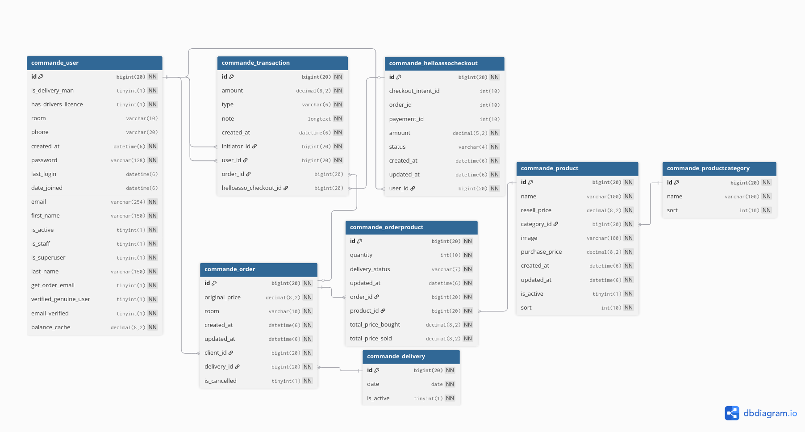

# Documentation technique détaillée du site Pain'Gouin

## Environnement de développement

L'environnement de développement inclus tout le nécessaire pour développer :
- Une base de donnée MariaDB
- Une base de donnée RabbitMQ (pour les tâches celery)
- Un serveur mail de dev Mailpit
- Une interface de gestion de base de donnée PHPMyAdmin

Est également mis en place des outils pour assurer la qualité du formatage et du code :
- `ruff` pour le code python
- `djlint` pour les templates
- `MyPy` comme vérificateur de type statique (le code ne respecte pas encore le typage statique, TODO)
- `prek`/`pre-commit` pour vérifier à l'aide des outils précédant la qualité avant chaque commit

De plus :
- `uv` est utilisé pour la gestion des dépendances python
- `fnm` est utilisé pour la gestion de Node.js (pour django-tailwind)

Des tâches/scripts sont mis en place pour simplifier certaines tâches, elles sont accessibles dans la barre des tâches de VS Code :
- Launch webserver permet de lancer le serveur web django et ainsi voir le rendu du site
- Lint/format all permet de lancer manuellement `prek`/`pre-commit`

En allant dans l'onglet **PORTS** de VS Code, vous pouvez ouvrir dans votre navigateur web le site Django, l'interface de Mailpit, et l'interface PHPMyAdmin.

## Hébergement/déploiement

Le site est déployé à l'aide d'un [conteneur Docker](../docker/Dockerfile) contenant : tout le code source, un serveur Django de production (gunicorn) ainsi qu'un service pour servir les fichiers statiques (whitenoise).

Tous les secrets doivent être passés au conteneur à l'aide de variables d'environnements.

### Test près-déploiement

Avant de déployer une version, il est important de tester le bon fonctionnement de l'image docker.

Après création d'un PR vers prod, une image est automatiquement construite avec le tag `dev`. Celle-ci est alors mise en ligne dans les 30 mins sur [paingouindev.rezoleo.fr](paingouindev.rezoleo.fr).

### Déploiement

Le flux général de déploiement est le suivant :

1. Les modifications sont poussées sur GitHub et une PR est ouverte vers la branche `prod`.
2. Une image avec le tag `dev` est construite et mise en ligne sur [paingouindev.rezoleo.fr](paingouindev.rezoleo.fr) dans les 30 mins. Après vérification du bon fonctionnement du site, il faut commenter "\tested" sur le PR, et re-lancer le test 'qa-gatekeeper' pour qu'il devienne valide, autorisant le merge.
3. Une fois les changements merge dans la branche `prod`, une action GitHub automatique fabrique et publie la nouvelle image du site internet sur le GHCR de l'organisation Github de PainGouin
4. Un Watchtower sur les serveurs de Rézoléo vérifie toutes les 30 minutes l'existence d'une nouvelle image, et met automatiquement le conteneur en prod à jour.
5. Les variables d'environnement (clés API, identifiants DB) sont gérées côté hébergeur, dans le docker-compose. Celui-ci est visible depuis l'accès SFTP PainGouin du Rézo. Il est nécessaire de passer par un membre du rézo pour les modifier.

> [!IMPORTANT]
> En cas de migration de la base de donnée, la commande `python manage.py migrate` s'exécute automatiquement au lancement du conteneur mise à jour.  
> Il faut bien avoir commit les migrations après les avoir générés à l'aide de la commande `python manage.py makemigrations`, et faire attention à ce qu'elle ne provoque pas de perte de données.  
> **Il est recommandé de faire un backup de la BD avant tout déploiement !**

> [!WARNING]
> Le serveur MySQL doit contenir une table des timezones afin que le panel admin de django-yubin fonctionne (pouvoir voir les logs des emails). Cf https://stackoverflow.com/a/21571350.

### Identifiants de connexion

Les identifiants de connexion au serveur SFTP des deux images sont :

- URL : [sftp.rezoleo.fr](sftp.rezoleo.fr)
- Port : 8888 (si connexion extérieur à la résidence sinon 22)
- Utilisateur : paingouin
- Mot de passe : **_Voir sheet sur le drive de paingouin_**

Les identifiants de connexion à l'interface PHPMyAdmin des deux images sont :

- URL : [phpmyadmin.rezoleo.fr](phpmyadmin.rezoleo.fr)
- Utilisateur : paingouin
- Mot de passe : **_Voir sheet sur le drive de paingouin_**

- URL : [phpmyadmin.rezoleo.fr](phpmyadmin.rezoleo.fr)
- Utilisateur : paingouindev
- Mot de passe : **_Voir sheet sur le drive de paingouin_**

Les identifiants de connexion à la base de donnée MySQL sont donc les mêmes avec pour hôte : mysql.rezoleo.fr

## Structure du repo

Les dossiers importants sont en gras

    📦site-v4
     ┣ 📂.devcontainer    // Environnement de dev
     ┣ 📂.github          // Description des "Github actions" automatique (CI/CD)
     ┣ 📂.vscode          // Scripts d'aide au développement
    *┣ 📂commande         // Application de gestion des commandes (tout le site)
       ┣ 📂migrations       // Migrations de la base de donnée
       ┣ 📂static           // Assets statics du site web (images, CSS, JS)
      *┣ 📂templates        // Templates générant les pages HTML du site
       ┣ 📂tests            // Tests du code (TODO)
       ┣ 📂utils            // Fonctions annexes utilisées par le reste du code
       ┣ __init__.py        // Boilerplate Python
       ┣ admin.py           // Code formant le panel administrateur du site
       ┣ apps.py            // Boilerplate Django
       ┣ forms.py           // Formulaires utilisés dans les views
      *┣ models.py          // Description des objets de la base de donnée
       ┣ tasks.py           // Tâches Celery, utilisées pour HelloAsso Checkout
       ┣ urls.py            // Définition des endpoints/urls du site
      *┗ views.py           // Définition des views/pages du site web
     ┣ 📂docker           // Description des conteneurs de prod et de dev, ainsi que des docker-compose
     ┣ 📂docs             // Documentation technique du projet
    *┣ 📂paingouin		  // Paramètres du projet (contenue dans `settings.py`)
    *┣ 📂templates        // Modification de certains templates de base des librairies
    *┣ 📂theme            // Style utilisé par TailwindCSS et Flowbite
    *┣ .env               // Paramètres actuellement utilisés par le site en développement (non inclus dans le repo)
     ┣ .env.dist          // Paramètres par défaut
     ┣ .gitignore         // Liste des fichiers à exclure du repo
     ┣ .nvmrc             // Configuration de la version de Nodes.js utilisé par django-tailwind. Node est ensuite géré par [fnm](https://github.com/Schniz/fnm) dans l'env de dev.
     ┣ .pre-commit-config.yaml  // Configuration de prek/pre-commit, utilisé pour assurer la qualité du code et pour l'action CI.
     ┣ .python-version    // Configuration de la version de Python utilisé
     ┣ manage.py          // Outil de gestion de Django
     ┣ Procfile.tailwind  // Utilisé par django-tailwind pour la compilation de tailwind à la volée et le lancement d'un worker celery
     ┣ pyproject.toml    // Définition et configuration des dépendances python du projet, géré à l'aide de [uv](https://docs.astral.sh/uv/)
     ┣ README.md         // fichier README...
     ┗ uv.lock           // Version des dépendances python actuellement utilisé par le site

## Structure de la base de donnée

La base de donnée de l'application commande est représentée de la manière suivante :

_Ce schéma n'est pas une représentation réelle de toute la base de donnée, Django a ses propres tables internes. Si vous êtes curieux, vous pouvez directement aller voir la base de donnée via le panel PHPMyAdmin._

Django utilise un ORM, et gère entièrement la base de donnée pour nous. Les "tables" sont définies dans [`commande/models.py`](../commande/models.py), qui répertorie les modèles utilisés par le site et comment ils intéragissent entre eux.

Pour modifier les modèles, il faut être familier avec le concept de [`migrations`](https://docs.djangoproject.com/en/5.2/topics/migrations/).  
Vous ne devriez jamais avoir besoin de toucher à la base de donné vous même !

Remarques :
- Le modèle `Transaction` empêche la suppression ou la modification pour garantir l'intégrité financière.
- Les relations entre `Order` → `OrderProduct` → `Product` permettent d'historiser prix et quantités au moment de la commande.

## Technologies utilisées

### Tailwind CSS

C'est une manière simplifié de faire du CSS, en n'utilisant que des classes.  
La version 4 de [tailwindCSS](https://tailwindcss.com/) est utilisée. Elle est intégrée à Django à l'aide de la librairie [django-tailwind](https://github.com/timonweb/django-tailwind).  
Pour développer avec tailwind, il est nécessaire d'utiliser la commande `python manage.py tailwind dev` au lieu de la commande `python manage.py runserver`. Cela permet d'automatiquement mettre à jour le fichier de style lorsqu'une page HTML est éditée, afin d'inclure les potentielles nouvelles fonctionnalités utilisées.  
En effet, seules les fonctionnalités de tailwind utilisées par le site web sont incluses dans la feuille de style, pour réduire sa taille.  
Avant "déploiement", il est nécessaire d'utiliser la commande `python manage.py tailwind build`, pour générer une feuille de style optimisée pour la prod, juste avant d'utiliser la commande `python manage.py collectstatic`. Cette étape est effectuée automatiquement lorsque le conteneur docker est utilisé.

### Flowbite

[Flowbite](https://flowbite.com/) est utilisé. Il permet l'utilisation de "components" UI déjà codés (boutons, sélecteurs, popups...).  
Il a été inclus comme plugin tailwind (via la commande `python manage.py tailwind plugin_install flowbite`), ce qui permet d'inclure le CSS optimisé en même temps que celui de Tailwind.  
Par ailleurs, le javascript nécessaire au bon fonctionnement des interactions est inclus via un fichier static, se situant dans `theme/static/js/dist/flowbite.min.js`. Si Flowbite est mis à jour, il faut également mettre à jour ce fichier, qui provient de `theme/static_src/node_modules/flowbite/dist/flowbite.min.js`, avec simplement la seconde ligne supprimée.

### Email

Les mails utilisent la librairie [django-yubin](https://github.com/APSL/django-yubin). Elle permet l'envoi de mails de façon asynchrone, ce qui permet d'éviter qu'une page ne soit plus réactive en cas de problème avec le serveur mail, et aussi d'afficher les mails envoyés dans le panel administrateur.

Son utilisation nécessite l'usage de [celery](https://docs.celeryq.dev/en/stable/index.html), un système permettant l'exécution de tâches programmées, qui nécessite un serveur de message : Redis ou [RabbitMQ](https://www.rabbitmq.com/) (le choix de RabbitMQ a été fait ici ~~afin de se compliquer encore plus la vie~~ sur conseil de la doc de celery).

Si vous voulez pouvoir faire du développement en local, il vous faut donc installer RabbitMQ, le configurer et lancer le serveur. Ce n'est pas évident et le lancement du serveur n'est pas automatisé. Je conseille donc plutôt d'utiliser le docker compose pour cela, qui inclut directement RabbitMQ, ainsi que [MailPit](https://github.com/axllent/mailpit) qui permet de tester la réception d'e-mails. Vous pouvez ne lancer que ces deux services et continuer à faire tourner le reste en local normalement, via la commande `tailwind dev`.

Dû à une incompatibilité entre Unfold et django-yubin, le dossier [templates](../templates/) permet de forcer une des vues de django-yubin à utiliser l'interface originale administrateur. Ce n'est pas très beau, mais ça fonctionne. Il ne faut pas oublier de mettre à jour ces fichiers si yubin ou Django est un jour mis à jour.

### Template pour les emails

Le langage de templating [MJML](https://mjml.io/) est utilisé pour l'écriture des emails. Il est intégré dans Django à l'aide de l'extension [django-mjml-template](https://github.com/Cruel/django-mjml-template), qui est une combinaison de [mjml-python](https://github.com/mgd020/mjml-python) et [django-mjml](https://github.com/liminspace/django-mjml): il utilise une version Rust de MJML, afin de ne pas avoir à utiliser Node.  
Si un jour django-mjml est mis à jour pour supporter la port Rust de MJML, il pourrait être judicieux de basculer sur cette extension.

Pour facilement éditer les templates de mail, vous pouvez soit utiliser l'extension VS Code [MJML Official](https://marketplace.visualstudio.com/items?itemName=mjmlio.vscode-mjml), ou utiliser le [live editor](https://mjml.io/try-it-live) sur le site de MJML.

### HelloAsso Checkout

La documentation peut être trouvée [ici](https://dev.helloasso.com/docs/description).

La documentation du SDK Python utilisé est [ici](https://github.com/HelloAsso/helloasso-python).

Hello asso a une [sandbox pour le développement](https://dev.helloasso.com/docs/environnements-production-et-sandbox-test).

## Permissions

Le système de permissions de Django n'est pas actuellement utilisé. À la place, une classe spéciale _CustomModelAdmin_ permet de gérer les permissions des staffeurs/administrateurs.

Le panel administrateur est accessible à toute personne ayant le champ _is_staff_ en True. Les administrateurs (staff) peuvent gérer les articles, les catégories, les livreurs, les livraisons, créer des transactions manuelles.  
Un administrateur ne doit pas être capable de faire quelque chose d'interdit (supprimer une transaction par exemple) ou qui casserait le site (supprimer un article qui casserait des références dans la BD, ou jouer avec des fields complexes dans le panel utilisateur).  
Un webmaster (superuser) peut tout faire, et donc tout casser. ATTENTION !

Pour mettre quelqu'un admin, il faut être admin. Pour mettre quelqu'un superuser, il faut être superuser.  
Il est également possible de faire cela depuis la phpmyadmin avec les codes qui sont sur le drive.
