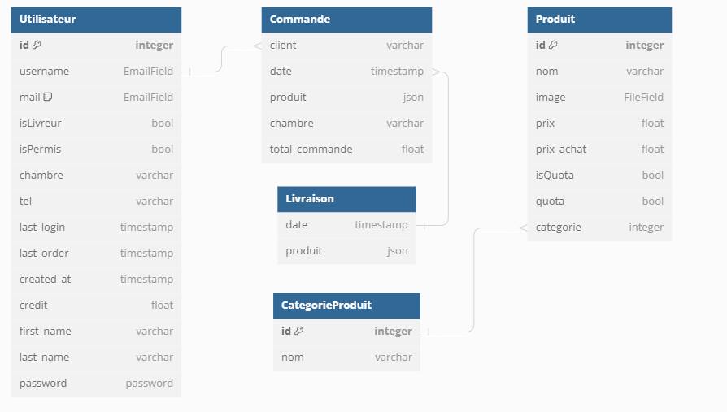

# Documentation détaillée du site Pain'Gouin

## Déploiement

### Test près-déploiement

Le site est déployé à l'aide d'un conteneur Docker contenant : tout le code source, un serveur Django de production (gunicorn) ainsi qu'un service pour servir les fichiers statiques (whitenoise).

Tous les secrets doivent être passés au conteneur à l'aide de variables d'environnements.

Avant de déployer une version, il est important de tester le bon fonctionnement de l'image docker. Pour cela, copier le fichier `compose.template.yaml` vers `compose.yaml`, en l'adaptant à son environnement de développement, et en lançant la construction et le déploiement en local de l'image à l'aide de la commande :

```console
docker compose up --build
```

> [!IMPORTANT]
> Pour tester l'image telle qu'elle sera déployée, bien désactiver le debug dans le docker compose !

Le site devrait alors être accessible à l'adresse http://127.0.0.1:8000/.

> [!NOTE]
> Si de nouvelles librairies sont nécessaires, il faut bien penser à mettre à jour le fichier `requirements.txt` à l'aide de la commande `pip freeze`.  
> Le fichier `requirement.minimal.txt` est censé contenir uniquement les dépendances primaires, et est utile pour la mise à jour des dépendances.

### Déploiement sur l'infrastructure de Rézoléo

**Après avoir testé le bon fonctionnement**, vous pouvez push vos changements sur la branche `prod`. Cela déclenchera une action Github, qui va automatiquement construire et uploader une image sur le GHCR. Un Watchtower sur les serveurs de Rézoléo devrait détecter cette nouvelle image, et automatiquement mettre à jour puis redéployer le conteneur tournant sur leurs serveurs.

> [!IMPORTANT]
> En cas de migration de la base de donnée, la commande `python manage.py migrate` s'exécute automatiquement au lancement du conteneur mise à jour.  
> Il faut bien avoir commit les migrations après les avoir générés à l'aide de la commande `python manage.py makemigrations`, et faire attention à ce qu'elle ne provoque pas de perte de données.  
> **Il est recommandé de faire un backup de la BD avant tout déploiement !**

Le stack utilise le serveur mySQL du rézo. Le docker compose le générant ainsi que les fichiers media se situent sur l'accès SFTP.

## Identifiants de connexion

Pain'Gouin est hébergé par l'association Rézoléo, en cas de problèmes d'hébergements, il ne faut pas hésiter à les contacter.

L'association Pain'Gouin dispose de deux images Docker, une première de développement et disponible à l'URL : paingouindev.rezoleo.fr et la deuxième pour le site utilisé en production à l'adresse : paingouin.rezoleo.fr. **Il est essentiel de s'assurer que le site fonctionne sur l'espace de développement avant de le basculer en production.**

Les identifiants de connexion au serveur SFTP des deux images sont :

- URL : sftp.rezoleo.fr
- Port : 8888 (si connexion extérieur à la résidence sinon 22)
- Utilisateur : paingouin
- Mot de passe : **_Voir sheet sur le drive de paingouin_**

Les identifiants de connexion à l'interface PHPMyAdmin des deux images sont :

- URL : phpmyadmin.rezoleo.fr
- Utilisateur : paingouin
- Mot de passe : **_Voir sheet sur le drive de paingouin_**

Les identifiants de connexion à MySQL sont donc les mêmes avec pour hôte : mysql.rezoleo.fr
Les identifiants associés aux différents mails pouvant être utilisés par le site sont disponibles sur le Drive de l'association.

## Structure du code

    📦site-v4
     ┣ 📂commande               // application de gestion des commandes
     ┣ 📂media                  // fichiers importé par l'utilisateur
     ┣ 📂paingouin		        // fichiers de base du projet
     ┣ 📂theme                  // style utilisé par TailwindCSS
     ┗ 📜README.md              // fichier README...

## Structure de la base de donnée

La base de donnée de l'application commande est représentée de la manière suivante (image ci-dessous), pour voir comment les modèles sont interprétés par Django, vous pouvez vous référer au fichier commande/models.py qui répertorie les modèles utilisés par le site.

Ce schéma n'est pas une représentation réelle de toute la base de donnée, Django a ses propres tables et la table utilisateur dérive d'une table de base de Django. Si vous êtes curieux, vous pouvez directement voir la base de donnée via le panel PHPMyAdmin.

## TailwindCSS

La version 4 de tailwind est utilisée. Elle est intégrée à Django à l'aide de la librairie [django-tailwind](https://github.com/timonweb/django-tailwind).  
Pour développer avec tailwind, il est nécessaire d'utiliser la commande `python manage.py tailwind dev` au lieu de la commande `python manage.py runserver`. Cela permet d'automatiquement mettre à jour le fichier de style lorsqu'une page HTML est éditée, afin d'inclure les potentielles nouvelles fonctionnalités utilisées.  
En effet, seules les fonctionnalités de tailwind utilisées par le site web sont incluses dans la feuille de style, pour réduire sa taille.  
Avant "déploiement", il est nécessaire d'utiliser la commande `python manage.py tailwind build`, pour générer une feuille de style optimisée pour la prod, juste avant d'utiliser la commande `python manage.py collectstatic`. Cette étape est effectuée automatiquement lorsque le conteneur docker est utilisé.

## Flowbite

Flowbite est utilisé.  
Il a été inclus comme plugin tailwind (via la commande `python manage.py tailwind plugin_install flowbite`), ce qui permet d'inclure le CSS optimisé en même temps que celui de Tailwind.  
Par ailleurs, le javascript nécessaire au bon fonctionnement des interactions est inclus via un fichier static, se situant dans `theme/static/js/dist/flowbite.min.js`. Si flowbite est mis à jour, il faut également mettre à jour ce fichier, qui provient de `theme/static_src/node_modules/flowbite/dist/flowbite.min.js`, avec simplement la seconde ligne supprimée.

## Email

Holala... quelle galère... Rien que les e-mails augmente la complexité du déploiement de beaucoup... (3 conteneurs au lieu d'un !)

Les mails utilisent la librairie [django-yubin](https://github.com/APSL/django-yubin). Elle permet l'envoi de mails de façon asynchrone, ce qui permet d'éviter qu'une page ne soit plus réactive en cas de problème avec le serveur mail, et aussi d'afficher les mails envoyés dans le panel administrateur.

Son utilisation nécessite l'usage de [celery](https://docs.celeryq.dev/en/stable/index.html), un système permettant l'exécution de tâches programmées, qui nécessite un serveur de message : Redis ou [RabbitMQ](https://www.rabbitmq.com/) (le choix de RabbitMQ a été fait ici ~~afin de se compliquer encore plus la vie~~ sur conseil de la doc de celery).

Si vous voulez pouvoir faire du développement en local, il vous faut donc installer RabbitMQ, le configurer et lancer le serveur. Ce n'est pas évident et le lancement du serveur n'est pas automatisé. Je conseille donc plutôt d'utiliser le docker compose pour cela, qui inclut directement RabbitMQ, ainsi que [MailPit](https://github.com/axllent/mailpit) qui permet de tester la réception d'e-mails. Vous pouvez ne lancer que ces deux services et continuer à faire tourner le reste en local normalement, via la commande `tailwind dev`.

Dû à une incompatibilité entre Unfold et django-yubin, le dossier [templates](../templates/) permet de forcer une des vues de django-yubin à utiliser l'interface originale administrateur. Ce n'est pas très beau, mais ça fonctionne. Il ne faut pas oublier de mettre à jour ces fichiers si yubin ou Django est un jour mis à jour.

## Template pour les emails

Le langage de templating [MJML](https://mjml.io/) est utilisé pour l'écriture des emails. Il est intégré dans Django à l'aide de l'extension [django-mjml-template](https://github.com/Cruel/django-mjml-template), qui est une combinaison de [mjml-python](https://github.com/mgd020/mjml-python) et [django-mjml](https://github.com/liminspace/django-mjml): il utilise une version Rust de MJML, afin de ne pas avoir à utiliser Node.  
Si un jour django-mjml est mis à jour pour supporter la port Rust de MJML, il pourrait être judicieux de basculer sur cette extension.

Pour facilement éditer les templates de mail, vous pouvez soit utiliser l'extension VS Code [MJML Official](https://marketplace.visualstudio.com/items?itemName=mjmlio.vscode-mjml), ou utiliser le [live editor](https://mjml.io/try-it-live) sur le site de MJML.
